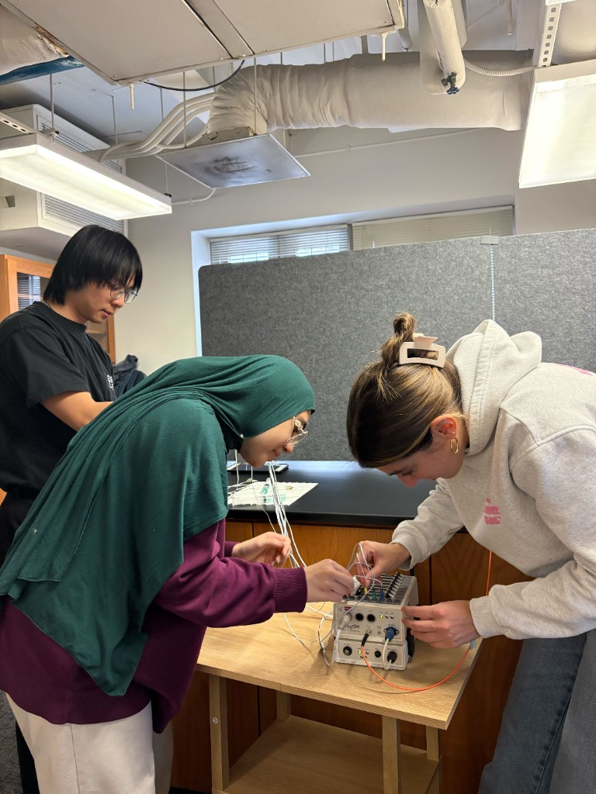
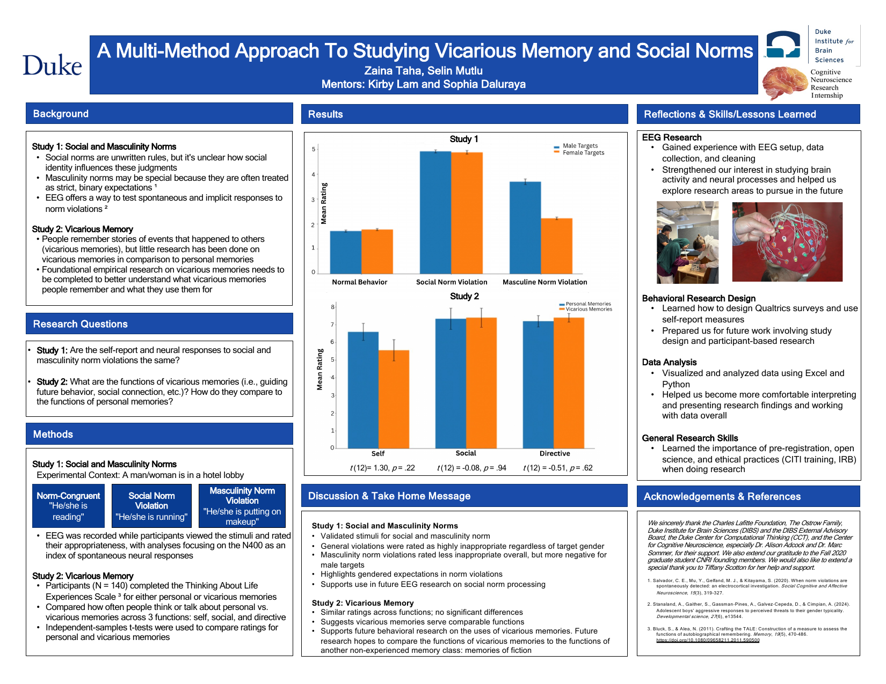
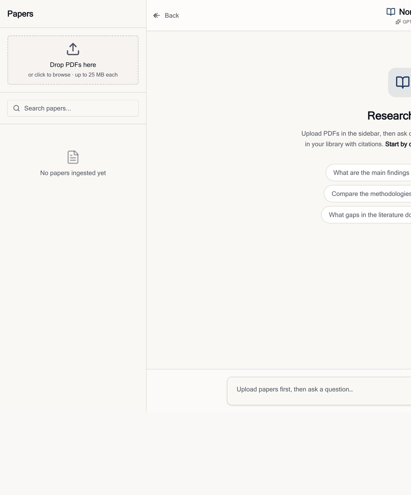
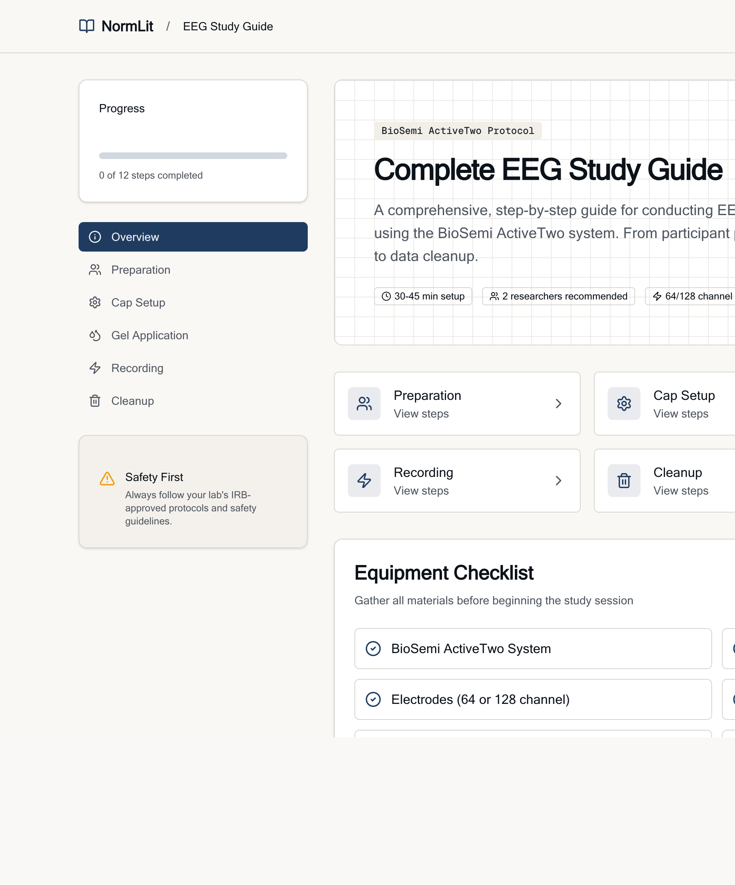
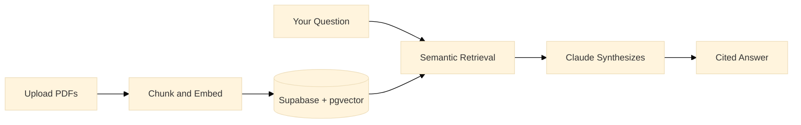

<p align="center">
  
</p>

<h1 align="center">NormLit</h1>

<p align="center">
  <strong>Research literature intelligence for cognitive neuroscience labs.</strong><br />
  Chat with your paper library. Get cited answers. Compare findings across studies.
</p>

<p align="center">
  <a href="https://v0-normlit-research-assistant.vercel.app"></a>
  <a href="https://v0-normlit-research-assistant.vercel.app/chat"></a>
</p>

<p align="center">
  
  
  
  
  
</p>

---

## The problem

In a cognitive neuroscience lab, literature review is brutal.

You cross-reference dozens of papers by hand. You hunt for the one paragraph that answers your question. You parse hundred-page equipment manuals just to run a single EEG session. The science is fascinating. The paperwork is not.

**NormLit** is the tool I wished my team had.

---

## Where it started

I built NormLit during **Duke's Cognitive Neuroscience Research Internship (CNRI)**, where I ran EEG research on how the brain processes **social norm violations** using the **N400 ERP component**.

Watching my team burn hours manually cross-referencing literature and parsing a 100-page EEG instruction packet, I wanted to build something that made that grind disappear.

NormLit uses **RAG and vector embeddings** to ground every answer in your uploaded papers, with **inline citations** you can trace back to the source.

<table>
  <tr>
    <td width="50%">
      
      <p align="center"><em>Setting up the BioSemi ActiveTwo during CNRI, the lab work that inspired NormLit.</em></p>
    </td>
    <td width="50%">
      
      <p align="center"><em>CNRI research poster on social and masculinity norms.</em></p>
    </td>
  </tr>
</table>

---

## What it does

<table>
  <tr>
    <td width="33%" valign="top">
      <h3>💬 Chat with Papers</h3>
      <p>Ask questions in natural language. Get answers synthesized from your library with inline citations.</p>
    </td>
    <td width="33%" valign="top">
      <h3>🔍 Semantic Search</h3>
      <p>Find relevant passages by <em>meaning</em>, not keywords. Filter by year, author, or specific papers.</p>
    </td>
    <td width="33%" valign="top">
      <h3>⚖️ Compare Findings</h3>
      <p>Select multiple papers and compare methodologies, results, or contradictions side by side.</p>
    </td>
  </tr>
</table>

<p align="center">
  
</p>

---

## Built for the lab, not just the literature

NormLit also ships with a **complete EEG Study Guide**, a step-by-step BioSemi ActiveTwo protocol born from that same 100-page instruction packet. From participant prep to cap setup, gel application, recording, and cleanup.

<p align="center">
  
</p>

<p align="center">
  <a href="https://v0-normlit-research-assistant.vercel.app/eeg-guide"><strong>→ Open the EEG Guide</strong></a>
</p>

---

## How it works



| Step | What happens |
|------|--------------|
| **Ingest** | PDFs are chunked and embedded with OpenAI `text-embedding-3-small` |
| **Store** | Vectors live in Supabase PostgreSQL via `pgvector` |
| **Retrieve** | Your question is embedded and matched with cosine similarity |
| **Answer** | Claude Opus 4.8 synthesizes a response with paper citations |

---

## Tech stack

| Layer | Tools |
|-------|-------|
| **Frontend** | Next.js 16, React, Tailwind CSS, shadcn/ui |
| **Backend** | Next.js API Routes, Vercel AI SDK 6 |
| **Database** | Supabase (PostgreSQL + pgvector) |
| **AI** | Claude Opus 4.8 (chat), OpenAI embeddings (search) |
| **Deploy** | Vercel |

---

## Quick start

### 1. Clone & install

```bash
git clone https://github.com/selinmutlu06/NormLit.git
cd NormLit
pnpm install
```

### 2. Environment variables

Create `.env.local`:

```bash
# Supabase
NEXT_PUBLIC_SUPABASE_URL=your_supabase_url
NEXT_PUBLIC_SUPABASE_ANON_KEY=your_supabase_anon_key
SUPABASE_SERVICE_ROLE_KEY=your_supabase_service_role_key

# OpenAI (embeddings)
OPENAI_API_KEY=your_openai_api_key

# Anthropic (chat)
ANTHROPIC_API_KEY=your_anthropic_api_key
```

### 3. Run

```bash
pnpm dev
```

Open [localhost:3000/chat](http://localhost:3000/chat), drop PDFs into the sidebar, and start asking questions.

### 4. Ingest papers (CLI)

```bash
npx tsx scripts/ingest-papers.ts ./path/to/papers
```

**Naming convention:** `Author (Year) - Title.pdf`

---

## Project structure

```
app/
  page.tsx              # Landing page
  chat/page.tsx         # RAG chat interface
  eeg-guide/page.tsx    # BioSemi EEG protocol guide
  api/
    chat/route.ts       # Chat + retrieval
    papers/route.ts     # Paper library
    compare/route.ts    # Cross-paper comparison
components/
  chat-message.tsx      # Citations rendering
  paper-sidebar.tsx     # Upload + filter
  compare-panel.tsx     # Paper comparison
lib/
  supabase/             # DB client
scripts/
  ingest-papers.ts      # PDF ingestion pipeline
docs/images/            # README screenshots & lab photos
```

---

## Links

- **Live app:** [v0-normlit-research-assistant.vercel.app](https://v0-normlit-research-assistant.vercel.app)
- **Chat:** [/chat](https://v0-normlit-research-assistant.vercel.app/chat)
- **EEG Guide:** [/eeg-guide](https://v0-normlit-research-assistant.vercel.app/eeg-guide)

---

<p align="center">
  Built at Duke CNRI. Designed for researchers who'd rather do science than paperwork.
</p>

<p align="center">
  <sub>MIT License</sub>
</p>
